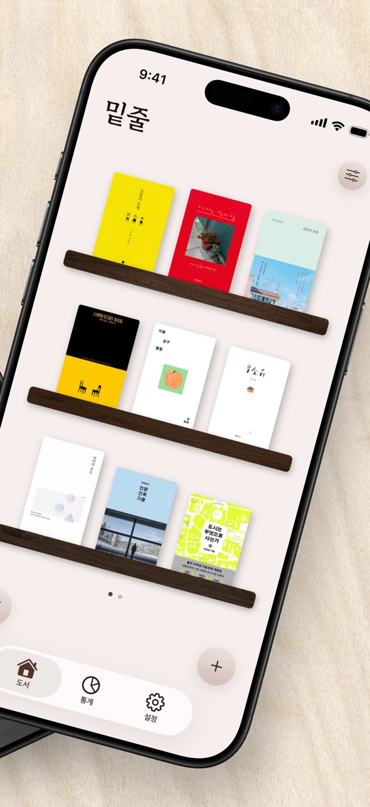
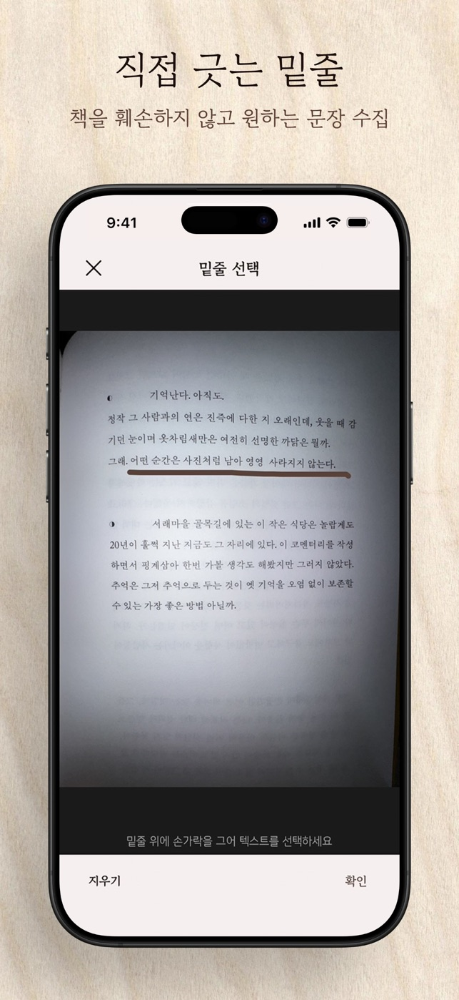
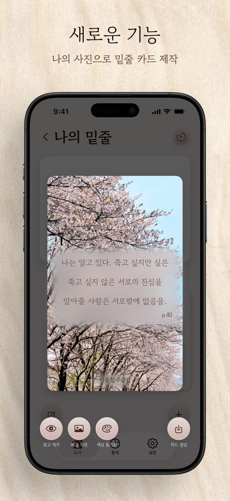
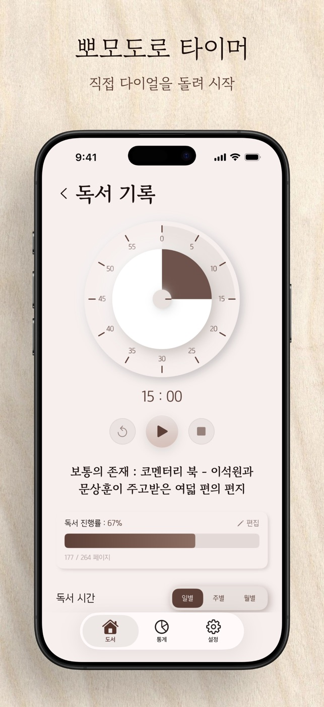
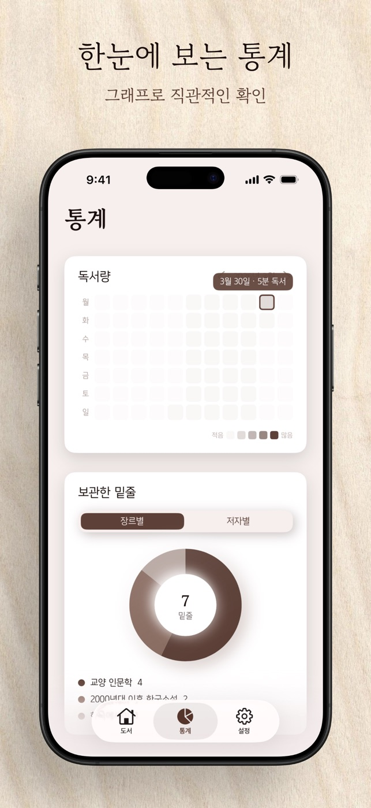
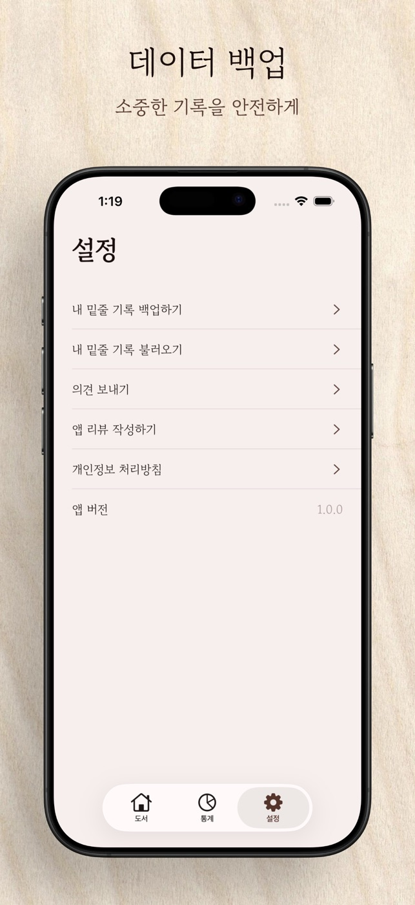
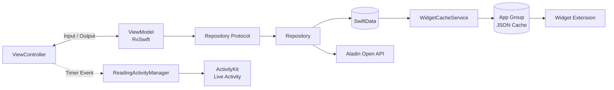

<div align="center">


# 밑줄

### 나만의 문장 수집 기록


<a href="https://apps.apple.com/kr/app/%EB%B0%91%EC%A4%84-%EB%82%98%EB%A7%8C%EC%9D%98-%EB%AC%B8%EC%9E%A5-%EC%88%98%EC%A7%91-%EA%B8%B0%EB%A1%9D/id6761336410">
  
</a>

</div>

## 프로젝트 소개

'밑줄'은 책 속에서 오래 간직하고 싶은 문장을 수집하고, 그날의 감정과 독서 시간을 함께 기록하는 독서 관리 앱입니다.

| 항목 | 내용 |
| --- | --- |
| 개발 기간 | 2026.04 ~ 2026.05 |
| 개발 형태 | 1인 개발 |
| 담당 역할 | 기획, 디자인, iOS 개발, 배포 전 과정 |
| 지원 환경 | iOS / iPad OS 17.6+ |

## 주요 화면

<table>
  <tr>
    <th>나만의 책장</th>
    <th>밑줄 제스처 OCR</th>
    <th>문장 카드 편집</th>
  </tr>
  <tr>
    <td></td>
    <td></td>
    <td></td>
  </tr>
  <tr>
    <th>독서 타이머</th>
    <th>독서 통계</th>
    <th>데이터 백업</th>
  </tr>
  <tr>
    <td></td>
    <td></td>
    <td></td>
  </tr>
</table>

## 주요 기능

- 알라딘 Open API 기반 도서 검색 및 추천 도서 제공

- 카메라 촬영과 밑줄 제스처를 이용한 OCR 문장 수집

- 페이지, 감정, 메모를 포함한 문장 카드 기록

- 사용자 사진을 활용한 문장 카드 편집 및 이미지 공유

- 다이얼 방식 독서 타이머와 도서별 독서 시간 기록

- 잠금 화면 및 Dynamic Island Live Activity

- 히트맵, 장르·저자별 문장, 주간·월간·연간 독서 통계

- 감정 기반 랜덤 문장과 홈 화면 위젯

- 도서·문장·독서 기록 JSON 백업 및 복원

## 기술적 고려사항

### 밑줄 제스처 기반 OCR

- 책의 한 페이지 전체가 아닌 사용자가 밑줄 그은 문장만 수집할 수 있도록 카메라 촬영과 선택 과정을 분리
  - `VNRecognizeTextRequest`의 `.accurate` 모드와 한국어·영어 인식, 언어 보정 적용
  - OCR 작업을 `Task.detached(priority: .userInitiated)`에서 실행하여 메인 스레드의 화면 반응성 확보
  - 이미지 방향을 `CGImagePropertyOrientation`으로 변환하고 Vision 정규화 좌표를 `aspectFit` 기준 화면 좌표로 보정
  - 사용자가 그린 선의 범위와 `VNRecognizedText`의 word-level bounding box를 비교해 필요한 단어만 조합
  - → 긴 문장 중 일부만 밑줄 그은 경우에도 선택 영역에 가까운 문장 추출

### 독서 타이머의 상태 연속성

- 화면 이동이나 앱의 활성 상태 변화와 관계없이 남은 시간이 일관되게 유지되어야 하므로 종료 시각을 기준으로 타이머 상태 관리
  - 다이얼로 설정한 시간과 실행·일시 정지·종료 상태를 `UserDefaults`에 저장하고 화면 재진입 시 복원
  - 타이머 종료 알림을 예약하여 앱이 전면에 없을 때도 종료 시점 안내
  - `ActivityKit`의 `ContentState`에 남은 시간, 실행 상태, 종료 시각을 전달하고 잠금 화면과 Dynamic Island에 표시
  - → 앱을 벗어나도 독서 흐름을 잃지 않고 현재 타이머 상태 확인 가능

### 로컬 데이터의 일관성과 복구

- 도서, 수집 문장, 독서 세션의 수명 주기가 연결되어 있어 화면에서 저장소를 직접 다루지 않도록 데이터 접근 경계 구성
  - `Book`, `Sentence`, `ReadingSession` 도메인 모델과 SwiftData의 `Record` 모델 분리
  - ViewModel이 구체 저장소가 아닌 Repository Protocol에 의존하도록 구성하고 `AppContainer`에서 의존성 조립
  - 도서 삭제 시 연결된 문장과 독서 세션까지 함께 정리하여 고립 데이터 방지
  - 백업 버전과 ISO 8601 날짜를 포함한 JSON으로 전체 기록을 내보내고, 복원 시 디코딩 후 한 번에 저장
  - → 서버 계정 없이 기기 안에서 기록을 관리하면서 재설치·기기 변경 상황에 대응

### 앱과 확장 기능 간 데이터 공유

- 메인 앱과 위젯은 서로 다른 프로세스에서 동작하므로 SwiftData 모델을 직접 공유하는 대신 가벼운 캐시 경로 구성
  - 전체 문장 중 하나를 선택해 공유 `Codable` 타입인 `WidgetSentenceEntry`로 변환
  - App Group 컨테이너에 JSON을 atomic write하고 `WidgetCenter.reloadTimelines`로 위젯 갱신
  - 메인 앱과 Widget Extension이 동일한 문장, 감정, 도서 정보를 해석하도록 Shared 타입 분리
  - → 저장 데이터 변경 이후 위젯에서도 동일한 문장 정보를 안정적으로 표시

## 아키텍처



- ViewModel은 `Input`과 `Output`으로 사용자 이벤트와 화면 상태를 구분
- `rxAsync`로 `async throws` 작업을 Observable로 연결하고 Dispose 시 내부 Task 취소
- Repository가 Aladin API와 SwiftData 접근을 담당하며 ViewController의 데이터 계층 직접 접근 차단
- 메인 앱은 UIKit과 SnapKit, Widget 및 Live Activity는 SwiftUI로 구성

## 기술 스택

| 구분 | 기술 |
| --- | --- |
| UI | UIKit, SwiftUI, SnapKit |
| Reactive | RxSwift, RxCocoa |
| Persistence | SwiftData, UserDefaults, App Group |
| Camera · OCR | AVFoundation, Vision |
| Extension | WidgetKit, ActivityKit |
| Network | Alamofire, Aladin Open API |
| Image | Kingfisher, UIGraphicsImageRenderer |
| Deployment | GitHub Actions, Fastlane, Match, TestFlight |

## 프로젝트 구조

```text
Under_line/
├── Screens/         # 화면과 사용자 상호작용
├── ViewModels/      # RxSwift Input/Output 기반 화면 로직
├── Repository/      # SwiftData 및 네트워크 데이터 접근
├── Network/         # Aladin API와 DTO 매핑
├── Models/          # 도메인 모델과 SwiftData Record
├── Services/        # 백업, 위젯 캐시, Live Activity
├── Views/           # 재사용 가능한 UI 컴포넌트
├── Shared/          # 앱과 Widget Extension 공유 타입
└── Config/          # 앱 의존성 조립

UnderLineWidget/     # 홈 화면 위젯과 Live Activity UI
```

## 배포 자동화

```text
release 브랜치 push
        ↓
GitHub Actions
        ↓
Fastlane + Match
        ↓
Archive & TestFlight 업로드
```

- GitHub Actions에서 Swift Package 캐시 복원, 앱 빌드, TestFlight 업로드 자동화
- Fastlane Match로 메인 앱과 Widget Extension의 배포 인증서 및 프로비저닝 프로파일 관리
- 알라딘 API 키와 App Store Connect·Match 인증 정보는 GitHub Secrets로 주입
- 로컬 API 키 파일은 `.gitignore`로 제외하여 저장소에 비밀 값이 포함되지 않도록 관리
